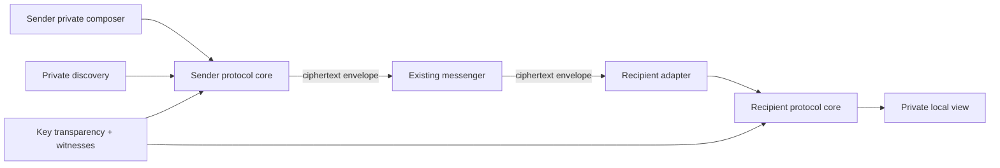
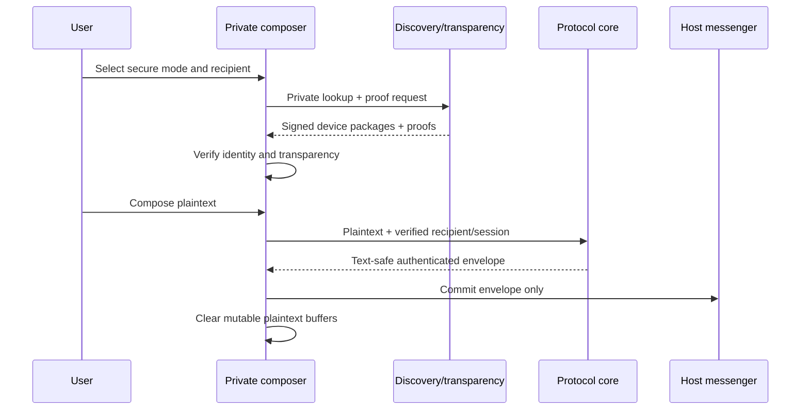

# System architecture

Status: Proposed architecture v0.1

## 1. Context

VeilBridge is an endpoint cryptographic adapter. The host messenger is treated as
an untrusted delivery service that transports printable envelopes.



Message plaintext does not enter the discovery service, transparency log, or
VeilBridge message server because no VeilBridge message server exists.

## 2. Components

### Client

- **Private composer:** captures secure-mode input without committing it to the
  host editor.
- **Recipient resolver:** maps a selected contact to verified devices.
- **Discovery client:** performs VOPRF queries and fetches opaque signed key
  packages.
- **Transparency verifier:** validates inclusion/consistency proofs and witness
  checkpoints.
- **Session engine:** establishes and advances reviewed one-to-one or MLS session
  state.
- **Envelope codec:** creates and parses the compact carrier-independent frame.
- **Identity vault:** wraps hardware-backed keys and encrypted session storage.
- **Carrier adapter:** inserts ciphertext and extracts candidate envelopes using
  platform-permitted mechanisms.
- **Private viewer:** authenticates before displaying plaintext.

### Services

- **Identifier verification:** confirms control of a discovery identifier while
  minimising its linkage to retained service data.
- **VOPRF discovery:** lets clients derive lookup labels without revealing raw
  identifiers to the evaluator.
- **Key-package store:** serves signed, expiring public device packages by opaque
  discovery label.
- **Transparency log:** records key-package history as an append-only structure.
- **Witnesses:** independently sign observed log checkpoints to make split-view
  attacks detectable.

Services do not receive message ciphertext unless a future optional carrier is
designed and separately approved.

## 3. Sending sequence



## 4. Receiving paths

### Android

The preferred receive adapter is opt-in notification access. It recognises a
candidate envelope in a posted message notification, authenticates it locally,
and emits a private VeilBridge notification. This is not universal: users must
grant access, some applications hide notification bodies, work profiles can
restrict listeners, and lock-screen policy varies.

The custom input method can also decrypt explicitly pasted or selected envelopes
as a fallback.

### iOS

iOS keyboard extensions cannot provide Android-style notification interception.
The supported baseline is an explicit keyboard, share-extension, or copy action,
depending on what App Review and current extension APIs permit. “Seamless” on
iOS therefore means a short, predictable action—not invisible background
decryption.

## 5. Protocol layering

```text
Carrier text
└── VeilBridge text-safe frame (version, metadata, opaque ciphertext)
    └── Session-protocol ciphertext
        ├── Direct session: reviewed asynchronous ratchet
        └── Group session: MLS candidate
```

The framing layer is not responsible for key agreement. The initial TypeScript
reference uses a caller-provided 256-bit content key only to verify framing,
associated-data binding, and interoperability. It must not be presented as a
complete session protocol.

## 6. Envelope v1 draft

The first frame is compact, deterministic, and independent of JSON parsing:

| Field | Size | Authenticated |
| --- | ---: | --- |
| Magic `VB` | 2 bytes | Yes |
| Version | 1 byte | Yes |
| Message type | 1 byte | Yes |
| Cipher suite | 2 bytes | Yes |
| Critical flags | 1 byte | Yes |
| Conversation ID | 16 bytes | Yes |
| Sender device ID | 16 bytes | Yes |
| Sequence | 8-byte unsigned integer | Yes |
| Nonce | 12 bytes | Intrinsic to AEAD |
| Ciphertext length | 4-byte unsigned integer | Structurally checked |
| Ciphertext and authentication tag | Variable | Yes |

The binary frame is base64url-encoded without padding and prefixed with `vb1.`.
The authenticated header is supplied as AEAD associated data. Unknown versions,
types, critical flags, invalid lengths, and oversized ciphertexts fail closed.

## 7. Discovery and decentralisation

Replicating every public key to every peer would grow storage linearly per device,
not solve private identifier lookup, and make scraping the social graph easier.

The staged design is:

1. VOPRF-based private discovery.
2. Signed expiring device key packages.
3. Append-only key transparency with multiple witnesses.
4. Federation between independently operated directories.
5. Optional DHT replication of content-addressed signed packages after privacy,
   poisoning, availability, and deletion behavior are formally analysed.

A DHT may improve availability, but it is not itself an identity or privacy
solution. Raw or plainly hashed phone numbers must never be DHT keys.

## 8. Deployment evolution

### Milestone 0 — executable specification

- Requirements, threat model, architecture, decisions.
- Envelope reference implementation and negative tests.
- Test-vector schema.

### Milestone 1 — Android proof of concept

- Private IME composer.
- Local identity vault.
- Manual test key injection only; no public-security claim.
- Ciphertext insertion and explicit decryption.

### Milestone 2 — discovery and authenticated sessions

- Identifier verification and VOPRF lookup.
- Transparency log and independent witness.
- Reviewed asynchronous session engine.
- Key-change and replay UX.

### Milestone 3 — iOS and interoperability

- iOS keyboard/share-extension adapter.
- Shared vectors across native implementations.
- Honest UX for OS limitations.

### Milestone 4 — groups and federation

- MLS evaluation and carrier-ordering tests.
- Multi-device membership.
- Federated operators and availability work.

## 9. Technology direction

- **Executable reference:** TypeScript on Node.js, with no runtime dependency for
  the v1 frame.
- **Mobile shared core candidate:** Rust compiled through narrow Android/iOS FFI,
  selected only after toolchain, library, audit, and maintenance evaluation.
- **Android:** Kotlin, `InputMethodService`, Android Keystore, optional
  `NotificationListenerService`.
- **iOS:** Swift, custom keyboard/share extensions, Keychain/Secure Enclave where
  supported.
- **Services:** implementation deferred until the discovery privacy model and
  abuse controls are reviewed.
